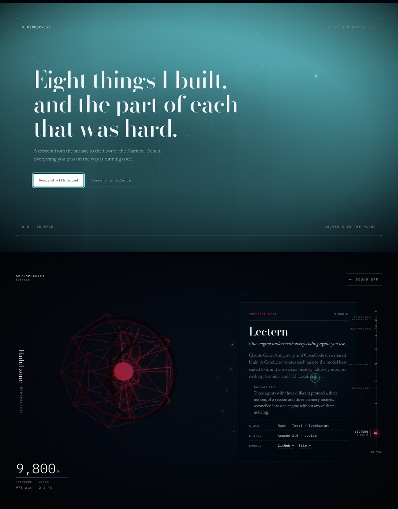

# Abyss

A portfolio built as one continuous descent from the ocean surface to Challenger Deep.
Eight projects are bioluminescent structures found at depth. Below 1,000 m the page goes
genuinely dark and your cursor becomes the lamp that finds them.

**[shrimpscript.vercel.app](https://shrimpscript.vercel.app)**



## What is actually going on

**Scroll is the source of truth, not depth.** Every block of content owns a scroll station
with a clamped minimum gap, so two blocks can never overlap however close their real
depths are. Depth is derived from scroll, which is why the readout crawls through the
crowded shallows and races through the empty trench while the camera falls at a constant
rate.

**Every number is real.** Pressure is one atmosphere per 10.06 m of seawater. Temperature
follows the actual profile through the thermocline, including the slight warming in the
trench from adiabatic compression. Red light is gone long before the twilight zone ends,
because that is what happens in water.

**Nothing is a stock component.** Eight procedural set-pieces, one per project, including
a verlet-solved ragdoll and a shader porthole looking into a lit room. No UI framework, no
CSS framework, no animation library. Audio is synthesised in Web Audio at runtime, so no
sound files ship.

## Running it

```
npm install
npm run dev
```

`npm test` runs the depth model tests. `npm run build` typechecks and builds.

## Getting around

Type any project name to warp to it. `Esc` returns to the surface. `#lectern` and
`#d=4200` are shareable links into the column. The rail on the right is the map.

## Stack

React 19, React Three Fiber, Lenis, and a small amount of GLSL.

## Verifying a change

`E2E.md` is the script. It drives real Chrome, captures the whole column at three widths,
proves the lamp mechanic, checks reduced motion and keyboard-only use, and measures frame
times on actual GPU hardware via ANGLE/Vulkan. The scene holds 60fps with no dropped
frames at every depth, measured on integrated graphics.

## Licence

MIT.
